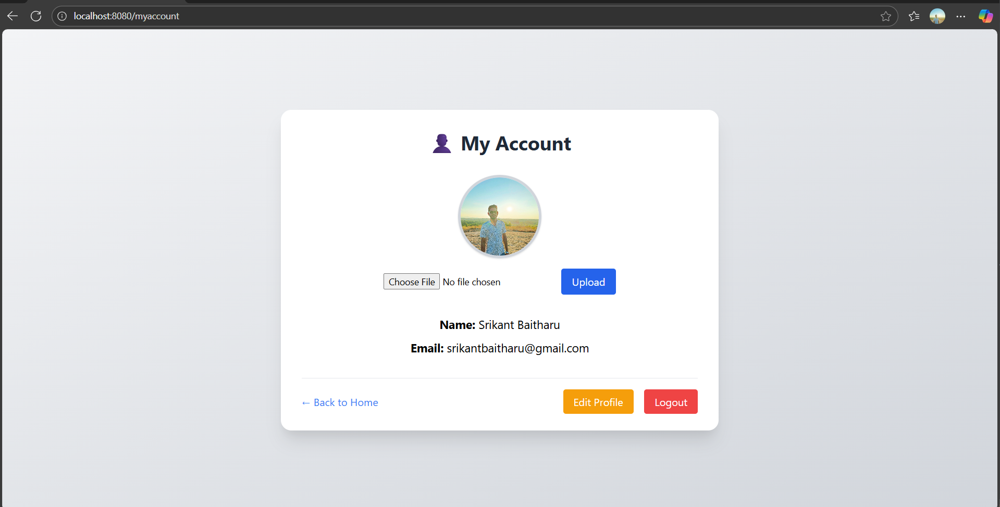
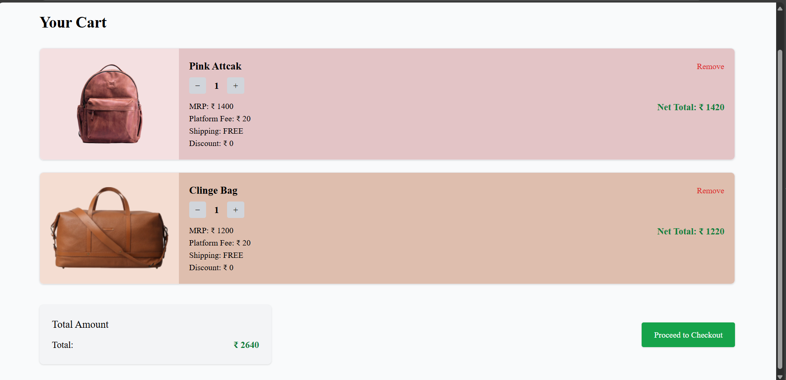
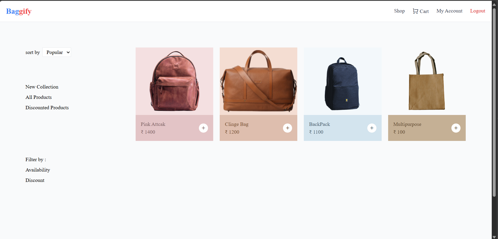

# 👜 Bag App(Baggify) – E-commerce for Stylish Bags

A full-stack e-commerce platform to browse, buy, and checkout premium bags online. Built with Node.js, Express, MongoDB, and Razorpay for seamless shopping experience.

---

## 🧱 Tech Stack

- **Frontend**: EJS + Tailwind CSS
- **Backend**: Node.js + Express.js
- **Database**: MongoDB + Mongoose
- **Auth**: Passport.js / Sessions
- **Payment Gateway**: Razorpay
- **Image Upload**: Multer
- **Deployment**: [EC2]
- **DevOps**: GitHub Actions , Docker 

---

## ⚙️ Features

- ✅ User Registration & Login
- ✅ Profile Picture Upload
- ✅ Add to Cart / Remove from Cart
- ✅ View Cart with Total Calculation
- ✅ Razorpay Payment Integration
- ✅ Admin Product Management (CRUD) 
- ✅ Fully Responsive EJS UI

---

## 📸 Screenshots

|  |  | .png) |
|        | 

---

## 🗺 Project Structure

┣ 📂config
┣ 📂controllers
┣ 📂middlewares
┣ 📂models
┣ 📂routes
┣ 📂views
┣ 📂public
┣ 📂utils
┣ 📄app.js
┣ 📄.env
┗ 📄README.md

## 🚀 Getting Started

1. **Clone the repo**
   ```bash
   git clone https://github.com/Srikant-Baitharu/Baggify-App.git
   cd baggify-app

2. **Install dependencies**
    npm install

3. **Create a .env file** (see .env.example)
    PORT = 8080
    JWT_SECRET=mysecret
    MONGODB_URI=your_mongodb_uri
    SESSION_SECRET=your_secret
    RAZORPAY_KEY_ID=your_key
    RAZORPAY_KEY_SECRET=your_secret

4. **Start the server**
    npm start or npx nodemon app.js

## Deployment
## Live Demo
[Click here to view the app](https://your-deployed-site.com)


## Credits
- [Razorpay Documentation](https://razorpay.com/docs/)
- [Tailwind CSS](https://tailwindcss.com/)

